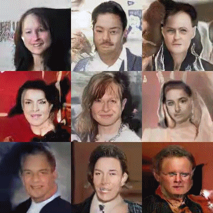
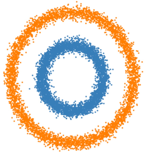
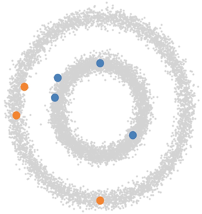

A semi-supervised GAN for image classification implemented in Pytorch

______________________

# Semi-Supervised Learning with GANs: a Tale of Cats and Dogs 
(First published as a [Scaleway blog post](https://blog.scaleway.com/2020/semi-supervised/))

*In this article we present an easy-to-grasp way of looking at semi-supervised machine learning - a solution to the common problem of not having enough labeled data. We then go through the steps of using a Generative Adversarial Network architecture for the task of image classification. Read on to find out how to get a 20% increase in accuracy\*  when distinguishing cats and dogs with only 100 labeled images!*

*\*Compared to the fully supervised classifier trained on labeled images only*

## Semi-Supervised Learning: the Why and the What
If you are at all interested in artificial intelligence, it is likely that reading about a new breakthrough achieved by an AI model has become part of your routine. One day [AI attains better accuracy on screening mammograms for breast cancer than trained experts](https://blog.google/technology/health/improving-breast-cancer-screening) (human or [avian](https://www.bbc.com/news/science-environment-34878151)), and next it [beats top human players at StarCraft II](https://www.nature.com/articles/d41586-019-03298-6). What is behind many of these success stories is deep learning: a branch of machine learning that deals with a particular class of models, deep artificial neural networks. Proposed as early as in [1960s](https://books.google.fr/books?id=rGFgAAAAMAAJ), this field has undergone a vigorous revival in the last decade, revolutionizing the domains of computer vision and natural language processing (NLP) along the way.

Advancing the current state-of-the-art in deep learning is often realised at the cost of introducing larger models than ever before. This comes with its own set of challenges. Naturally, models with a lot of trainable parameters (tens and even hundreds of millions is not uncommon at this point!) require large training sets. Supervised machine learning remains the go-to approach for many practical applications - meaning that these training sets often have to be manually labeled. There are different strategies aimed at getting away with a smaller amount of training data, such as transfer learning (pre-training the model on an existing, large dataset). Alternatively, you can come up with a self-supervised task, where the data will be "labeled" automatically, and fine-tune the model later on. The self-supervised learning approach has proven especially useful in NLP, where [word embeddings](https://towardsdatascience.com/what-the-heck-is-word-embedding-b30f67f01c81) can be pre-trained via masked language modeling (predicting words that are omitted from a sentence at random) and then used on downstream supervised tasks, such as question answering, machine translation etc.

Not every task is susceptible to this kind of treatment, however. Take image classification as an example. It is difficult to come up with an automatic labelling scheme for a pre-trained self-supervised model that would be useful for the classification task at hand. Transfer learning, on the other hand, has come to be the starting point of choice for many computer vision applications. However, let us consider a scenario when, while a subset of our training data is labelled, the rest is not. Transfer learning alone has no use for the unlabelled part of the training set, but is there any way we can still benefit from those unlabelled training samples? Indeed, that is what the so-called semi-supervised learning is all about.

For many domains of interest, gathering data is relatively easy, whereas labelling it by human experts is expensive and time consuming. Semi-supervised learning provides a solution by learning the patterns present in unlabelled data, and combining that knowledge with the (generally, fewer) labeled training samples in order to accomplish a supervised learning task - e.g. image classification.

In this post we are going to consider a semi-supervised learning approach that involves [Generative Adversarial Networks (GANs)](https://arxiv.org/abs/1406.2661), an artificial neural network architecture that was originally developed in the context of unsupervised learning. The latter means that the training data is unlabeled, and the sole goal of the GAN is to generate new synthetic data coming from the same distribution as those in the training set. That is to say that a GAN trained on the (unlabelled) [MNIST](https://en.wikipedia.org/wiki/MNIST_database) set of handwritten digits would produce images that look like, well - handwritten digits!

The idea behind using GANs for semi-supervised learning can be roughly understood in the following way: say your training set is MNIST, but only a few examples of each digit from 0 to 9 are actually labeled. A good GAN that has been trained on unlabelled MNIST would learn to generate various versions of all the digits - suggesting that it knows a thing or ~~ten~~ two about the underlying data distribution. We can then think of a part of what the GAN is doing as almost a form of *clustering:* assigning data points to groups based on their features. Since a few points out of each cluster are labeled, we can proceed to label the rest of the points accordingly, arriving at what we were after all along: a handwritten digit classifier.

Before we dive into the intricacies of a semi-supervised GAN, let us review the original unsupervised GAN architecture.

## Generative Adversarial Networks: this GAN does not exist

Generative Adversarial Networks, or, as Yann LeCun, VP and Chief AI Scientist at Facebook, once put it, "the most interesting idea in the last ten years in Machine Learning", were invented [back in 2014 by Ian Goodfellow and company](https://arxiv.org/abs/1406.2661). GANs are the artificial brains behind the impressive [ThisPersonDoesNotExist.com](https://thispersondoesnotexist.com), the cute [ThisCatDoesNotExist.com](https://thiscatdoesnotexist.com), but, however, not the at-times-surprising [ThisSnackDoesNotExist.com](https://thissnackdoesnotexist.com).

In a standard GAN setup, there are two networks: a *Generator*, producing images out of input noise vectors, and a *Discriminator*. The objective of the Discriminator is to detect which images are coming from the training set (i.e. "are real") and which ones have been produced by the Generator (i.e. "are fake"). It follows that as far as  the Discriminator is concerned, the problem is simply that of binary classification. The way, that the Generator is trained, is a little less straightforward: its task is to fool the Discriminator. While this may sound cryptic, the implementation is simple enough. First, the Generator takes in a vector of random noise as input and produces an image. Naturally, the output image depends on the Generator's parameters. Then this synthetic image gets passed on as input to the Discriminator, which will return, say, the probability of the image being real (i.e. coming from the training set). At this point we are going to keep the Discriminator unchanged, and instead update the Generator in such a way that its next output would be more likely to be accepted by the Discriminator as real. The Discriminator and the Generator proceed to be updated in an alternating manner, once each for every mini batch of the training data. To see a Pytorch implementation of a GAN with (de)convolutional layers, called [DCGAN](https://arxiv.org/abs/1511.06434), you can checkout [this tutorial](https://pytorch.org/tutorials/beginner/dcgan_faces_tutorial.html).

## GANs in Semi-Supervised Learning
In an unsupervised GAN, what you are after is the Generator. The Discriminator is just a means to an end: it is used to train the Generator, only to be discarded at the end. In this section, we are going to switch gears and look at what the Discriminator has to offer in the semi-supervised setting.

### Semi-Supervised GAN: the 200 Words Summary
Let's go back to that "clustering" idea that we handwaved around back in the introduction. Imagine your classification task is concerned with datapoints that only have two features (which makes them easy to plot by taking one feature as *x* and the other as *y* coordinates on a plane). Moreover, here is what your data looks like when plotted:

There are two circles (rings with certain radii, to be precise), each corresponding to its own class: *oranges* and *blues*. Frankly, you don't need deep learning to tackle this problem: a simple [classical machine learning approach would do the trick](https://scikit-learn.org/stable/auto_examples/classification/plot_classifier_comparison.html). But bear with me! Let's say you only have a few of the points actually labeled, perhaps something along the lines of:

If you were to only use the few labeled points that you have to train your classification model, you obviously would not get very far. A GAN, however, will easily figure out that it is to generate points within the two rings, when you provide it with the whole dataset (including the unlabelled greyed out points). The labeled points can then be used to classify the two rings as belonging to two separate classes and voilà, you are done!

### Discriminator to Classifier
It is time to see how all this can be carried out in practice  \[[1](https://arxiv.org/abs/1606.03498), [2](https://arxiv.org/abs/1511.06390)\]. Consider an image classification problem that has *K* classes (e.g. *K = 10* for handwritten digit recognition, or *K = 2* for the toy dataset with two circles above). Let us add an additional class that will designate "fake" images - meaning, the ones that do not come from the training set. Sounds familiar? Indeed, we can use the resulting Classifier with *K+1* classes in place of the Discriminator that we had in the unsupervised GAN. If the image gets assigned to one of the first *K* classes, we are going to deem it "real", whereas class *K+1* is reserved for images that the Classifier believes to have been generated by the Generator.

The training scheme for the Generator remains largely unchanged: its objective is to produce images that the Classifier will assign to one of the original *K* classes. In the simplest case that we are considering, the Generator does not care which ones, as long as they are "real".

The Discr... I mean, Classifier will have more on its plate this time. There are three types of data that it will have access to:

* labeled training data (that we want the Classifier to assign to correct classes)

* unlabeled training data (that we just want assigned to *one of K* classes)

* synthetic/generated/fake data - i.e. the images that have been generated by the Generator. These should get assigned to the additional class, *K+1*.

Aside from having two kinds of real data to deal with (and, as a result, two contributions to the loss function for the real images), the training of the semi-supervised Classifier is carried out in much the same way as that of the unsupervised Discriminator above.

Before we get coding, however, let us think about the Generator for a second. Having seen the very impressive results that have been obtained for the unsupervised GANs, one might wonder how good are the Generators trained in the semi-supervised regime (even if we do care mainly about the Classifier in this case).

